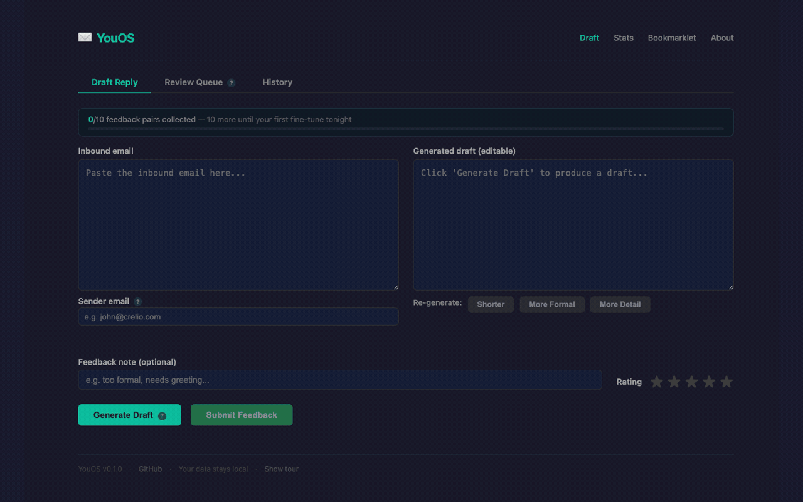

# YouOS ✉️

> **Your email. Your model. Your style.**

YouOS is a local-first AI email copilot that learns from your sent Gmail history and drafts replies that sound like *you* — not a generic AI. It runs entirely on your Mac. No cloud. No subscriptions. Your data never leaves your machine.

```
Gmail (sent mail)          Your feedback
       │                        │
       ▼                        ▼
  Ingestion pipeline      Review Queue
  (gog CLI + SQLite)      (10 emails/batch)
       │                        │
       ▼                        ▼
  Reply Pairs DB  ──────► LoRA Fine-tuning
  (FTS5 + BM25)           (Qwen, nightly)
       │                        │
       ▼                        ▼
  Draft Generation ◄──── Autoresearch
  (local Qwen MLX)        (80 iterations/night)
       │
       ▼
  Draft Reply ✅
```

**Privacy:** Everything stays local. Your corpus, model, and drafts never leave your Mac.



> 🌐 [Landing page](https://dewy-haven-wgpz.here.now/)

## What it does

- Ingests your sent Gmail history, Google Docs, and WhatsApp exports
- Learns your writing style — richer persona: bullet point rate, directness score, sentence length, paragraph style, all merged nightly
- Per-sender-type personas: different voice, length, greeting, and closing for internal, external client, and personal contacts
- Classifies inbound intent (meeting request, approval, status update, complaint, etc.) and boosts matching exemplars
- Drafts grounded in score-ranked few-shot exemplars (confidence-annotated, thread-deduplicated); subject line used as retrieval signal
- Same-thread history gets a 2x retrieval boost — strongest possible context signal
- Handles full email threads — paste the whole thread, YouOS focuses on the latest message
- Warns you when confidence is low (no strong precedents found); explain any draft: `How was this generated?`
- Improves from your feedback via LoRA fine-tuning — quality-filtered, curriculum-ordered, DPO preference pairs supported
- Auto-scales training hyperparameters as your corpus grows; hybrid token+character similarity for auto-feedback capture
- Self-optimizes nightly via autoresearch — configurable composite weights, sender-type boosts, intent signals
- Style drift detection: notified in the Stats dashboard when your writing patterns shift significantly
- Feedback loop closes: high-rating, low-edit pairs surface higher in future retrievals
- Sender profiles track reply-time patterns; notes trigger immediate profile rebuild
- Embedding cache for fast repeated retrieval; corpus health at a glance: `youos corpus`
- Run a golden benchmark anytime: `youos eval --golden`
- Runs entirely locally on Apple Silicon

## Requirements

- Apple Silicon Mac (M1/M2/M3/M4)
- 8GB+ RAM (16GB recommended)
- Python 3.11+
- [gog CLI](https://github.com/openclaw/gog) configured with your Gmail account(s)
- ~5GB free disk space

## Quick start

```bash
# Clone and install
cd ~/Projects/youos
pip install -e .

# Run the setup wizard
youos setup

# Or run directly
python3 scripts/setup_wizard.py
```

The setup wizard walks you through:
1. Dependency check
2. Gmail account configuration
3. Email corpus ingestion
4. Writing style analysis
5. Optional initial fine-tuning
6. Server setup

## Usage

```bash
# Draft a reply
youos draft "Hi, can we schedule a call next week to discuss the proposal?"

# Draft with sender context
youos draft --sender john@company.com "email text here"

# Open the web UI
youos ui

# Check system status
youos status

# View corpus stats
youos stats

# Full corpus health report (pair count, quality scores, top senders)
youos corpus
youos corpus --json   # raw JSON output

# Add a sender note (immediately rebuilds their profile)
youos note john@company.com "prefers bullet points, decision-maker"

# Run nightly pipeline manually (with step-by-step output)
youos improve --verbose

# Check system requirements
youos doctor

# Run golden benchmark evaluation
youos eval --golden

# Start the web server
youos serve

# Ingest a WhatsApp export
youos ingest --whatsapp ~/Downloads/WhatsApp-Chat.txt
```

## Web UI

The web UI provides:
- **Draft Reply**: Paste an inbound email (or full thread), generate a draft, edit and submit feedback. See confidence level, detected intent, and exemplar trace via "How was this generated?"
- **Review Queue**: Review auto-generated drafts — configurable batch size (5/10/20), keyboard shortcuts (`j`/`k`)
- **Stats Dashboard**: Corpus health, model status, pipeline status, style drift indicator, benchmark trends
- **Gmail Bookmarklet**: One-click drafting from Gmail

## Architecture

```
app/
  main.py              # FastAPI application
  api/                 # HTTP endpoints
  core/                # Config, embeddings, sender classification
  db/                  # SQLite bootstrap and migrations
  generation/          # Draft generation (local Qwen + Claude fallback)
  ingestion/           # Gmail, Google Docs, WhatsApp importers
  retrieval/           # FTS5 + semantic search
  evaluation/          # Benchmark scoring
  autoresearch/        # Automated config optimization

scripts/               # CLI tools and pipeline scripts
configs/               # Persona, prompts, retrieval settings
templates/             # Web UI (feedback, stats, bookmarklet)
```

## Privacy

All data stays on your machine. No email content is ever sent to a cloud service unless you explicitly use an external LLM for draft generation (configurable). See [PRIVACY.md](PRIVACY.md).

## Configuration

All settings are in `youos_config.yaml`, created by the setup wizard:

```yaml
user:
  name: "Your Name"
  emails: ["you@company.com", "you@gmail.com"]

model:
  base: "Qwen/Qwen2.5-1.5B-Instruct"
  fallback: "claude"  # or "none" for fully local

autoresearch:
  enabled: true
  schedule: "0 1 * * *"
```

## License

Open source. See LICENSE for details.
